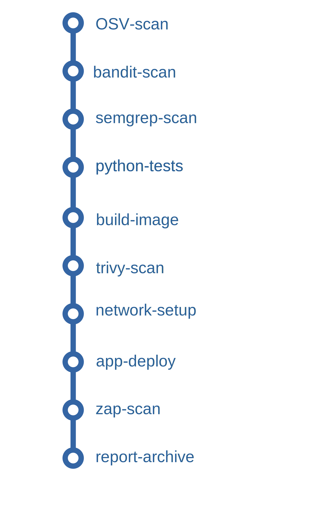

+++
title = 'A Practical Guide to Integrating Security into Your Jenkins Pipeline'
date = 2025-08-08T13:03:51-04:00
draft = false
+++

In modern software development, "shifting left" is more than just a buzzword; it's a crucial practice for building secure and reliable applications. By integrating security testing early and continuously in the development lifecycle, I can catch vulnerabilities before they reach production.

To demonstrate this in practice, I’ll walk through how to build a Jenkins pipeline that integrates security checks at multiple stages. I'll start with a basic Jenkins setup for a Python application and incrementally add multiple layers of automated security scanning:

  * **Static Application Security Testing (SAST)** to analyze source code.
  * **Dynamic Application Security Testing (DAST)** to test the running application.
  * **Software Composition Analysis (SCA)** to find vulnerabilities in dependencies, including container image scanning.

By the end, you'll have a clear blueprint for building security into your own
CI/CD automation. I'll achieve this by integrating popular open-source tools
like OSV-Scanner, Semgrep, Trivy, and OWASP ZAP, providing a cost-effective and
powerful security solution.

## The Starting Point: A Basic CI/CD Pipeline

Initially, my project had a standard `Jenkinsfile` that automated the core tasks of testing and deployment. The pipeline had four stages:

1.  **python-tests**: Ran unit tests using `make test` inside a Python container.
2.  **build-image**: Built a Docker image from a Dockerfile.
3.  **network-setup**: Created a dedicated Docker network for the application to run on.
4.  **app-deploy**: Deployed the application as a container on the newly created network.

This is a great start for continuous integration, but it has a major blind spot: it does nothing to check for security vulnerabilities. To address this gap, I’ll start layering in security checks, beginning with static analysis.


The diagram above shows the initial pipeline structure before adding any security steps.

## Layer 1: Static Analysis (SAST & SCA)

The first step in securing our pipeline is to scan the source code before I even build an image. This involves two types of static analysis.

### SCA: Scanning Dependencies with OSV-Scanner

Software Composition Analysis (SCA) tools scan your project's dependencies for known vulnerabilities. Since modern applications are built on a mountain of open-source libraries, this is a critical first step.

I added a new stage, `OSV-scan`, which uses Google's OSV-Scanner to check the Python packages in the `./src` directory and generate a JSON report.

**Code Snippet: OSV-Scanner Stage**

```groovy
stage('OSV-scan') {
    steps {
        script {
            sh 'echo "[*] OSV-scan scanning"'
            sh 'mkdir -p ${REPORTS_DIR}' 
            // Run the OSV-Scanner Docker image
            docker.image('ghcr.io/google/osv-scanner:latest').inside('--entrypoint "" ') {
                // Run the OSV-Scanner command and generate the JSON report
                sh "/osv-scanner --format json -r ./src > ${REPORTS_DIR}/osv-results.json || true" 
            }
        }
    }
}
```

*Notice the `|| true` at the end of the command. This ensures that even if vulnerabilities are found, the pipeline doesn't stop. This allows us to collect reports from all scanners before deciding whether to fail the build.*

While SCA focuses on third-party dependencies, I also need to analyze our own source code for insecure practices.

### SAST: Scanning Code with Bandit and Semgrep

Static Application Security Testing (SAST) tools analyze your custom source code for security flaws and bad practices. I used two different tools for broader coverage.

**Bandit** is a tool designed specifically for finding common security issues in Python code. The `bandit-scan` stage installs `bandit` via `pip` and then runs it against the `./src` directory, generating an HTML report.

**Code Snippet: Bandit Scan Stage**

```groovy
stage('bandit-scan') {
    steps {
        script {
             sh 'echo "[*] bandit scanning"'
             docker.image('python:3.9-slim-buster').inside(' -u 0 ') {
                sh 'pip install bandit ' 
                sh "bandit -r ./src -f html -o ${REPORTS_DIR}/bandit-report.html --severity-level low || true" 
            }
        }
    }
}
```

I use the `-u 0` option to run the container as the root user, which is necessary to grant `pip` permission to install `bandit` in this particular base image.

Also, in practice, you may want to adjust Bandit’s severity threshold to reduce noise depending on your team’s tolerance.

To complement Bandit’s Python-specific checks, I add Semgrep, which provides broader, language-agnostic coverage.”

**Semgrep** is a powerful, polyglot static analysis tool that uses a vast registry of rules to find security issues, bugs, and anti-patterns. The `semgrep-scan` stage runs the official Semgrep image and tells it to automatically detect the project type and scan for relevant issues.

**Code Snippet: Semgrep Scan Stage**

```groovy
stage('semgrep-scan') {
    steps {
        script {
             sh 'echo "[*] semgrep scanning"'
             docker.image('returntocorp/semgrep').inside {
                sh "semgrep --config=auto . --output=${REPORTS_DIR}/semgrep-results.txt || true" 
            }
        }
    }
}
```

Here I allow the scan to continue regardless of results (`|| true`), but you may choose to fail the pipeline on critical findings depending on your security posture.

## Layer 2: Container Image Scanning with Trivy

Scanning the source code is essential, but vulnerabilities can also exist in the operating system packages or other layers of the final Docker image. After the `build-image` stage, I added a `trivy-scan` stage to analyze the built container image.

This stage uses `aquasec/trivy` to scan the Docker image saved as a Docker `.tar` archive. It's configured to only fail on MEDIUM, HIGH, or CRITICAL severity vulnerabilities and outputs a JSON report, which is then copied to the reports directory.

**Code Snippet: Trivy Scan Stage**

```groovy
stage('trivy-scan') {
    steps {
        script {
            sh 'echo "[*] Trivy scanning"'
            docker.image('aquasec/trivy:latest').inside('--entrypoint "" ') {
                 sh 'trivy image --exit-code "1" --severity "MEDIUM,HIGH,CRITICAL" --format json --output report_trivy.json --input proj1.latest.tar || true' 
                sh "cp report_trivy.json ${REPORTS_DIR}/" 
            }
        }
    }
}
```

With our image secured, the next step is to test how the application behaves when it’s actually running.

## Layer 3: Dynamic Analysis (DAST) with OWASP ZAP

Static and image scanning are powerful, but they can't find vulnerabilities that only appear when the application is running. Dynamic Application Security Testing (DAST) addresses this by probing the live application.

To achieve this within our pipeline,  first need to get the application up and running in an isolated environment.

To do this, the pipeline first deploys the application container (`proj1`) and then runs a second container with the OWASP Zed Attack Proxy (ZAP) scanner. Both containers are connected to the same dedicated Docker network (`ci-dast-network-${BUILD_NUMBER}`) , allowing ZAP to target the application using its container name. This approach keeps the pipeline self-contained, with the scanner isolated in its own container but able to probe the target application.

The `zap-scan` stage starts ZAP in "baseline" mode, which performs a quick, passive scan against the application's URL. After the scan is complete, the generated HTML report is copied from the ZAP container to the Jenkins workspace for archival.

**Code Snippet: ZAP Scan Stage**

```groovy
stage('zap-scan') {
    steps {
        script {
            echo "Starting OWASP ZAP DAST Scan..." 

            // ZAP will target the app container by its name on the shared Docker network
            def targetUrl = "http://${APP_CONTAINER_NAME}:${APP_INTERNAL_PORT}"

            sh "docker run --name ${ZAP_CONTAINER_NAME} --network ${DOCKER_NETWORK_NAME} -p 8090:8090 -i zaproxy/zap-bare zap.sh -cmd -port 8090 -quickurl ${targetUrl} -quickout /zap/zap-report.html" 
            sh "docker cp ${ZAP_CONTAINER_NAME}:/zap/zap-report.html ${REPORTS_DIR}/${ZAP_HTML_REPORT}" 
            
        }
    }
}
```

Note: The ZAP baseline scan only performs passive checks. For deeper coverage, you could enable an ‘active’ scan, but that may increase runtime and risk false positives.

In my setup, the pipeline never fails automatically on vulnerabilities - it only generates reports. Depending on your risk appetite, you could enforce stricter gates (e.g., fail on CRITICAL findings).”

## The Final Result: A Complete DevSecOps Pipeline

After adding all the security stages, the pipeline is far more robust. The final stage, `Archive Reports`, uses the `archiveArtifacts` step to save all the generated reports from our security tools.

Finally, the `post` block ensures that no matter what happens, the pipeline cleans up after itself by stopping and removing the application and ZAP containers and dismantling the Docker network.

Here’s how the pipeline looks after adding all security stages.



At this point, our pipeline not only automates builds and deployments but also provides continuous, automated security validation.

## Conclusion

By integrating a variety of open-source security tools directly into our Jenkinsfile, I have transformed a basic CI/CD pipeline into a powerful DevSecOps workflow. This multi-layered approach provides comprehensive, automated security feedback at every stage of the development process, from code commit to deployment. This not only makes our applications more secure but also empowers developers to find and fix issues faster, truly "shifting security left."
