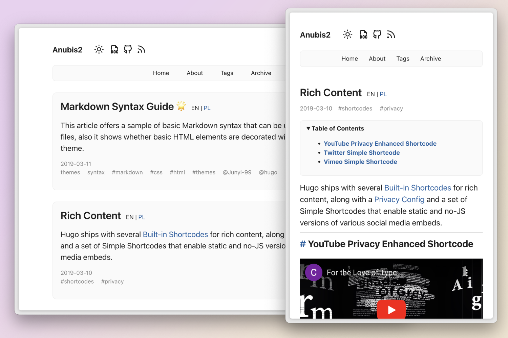
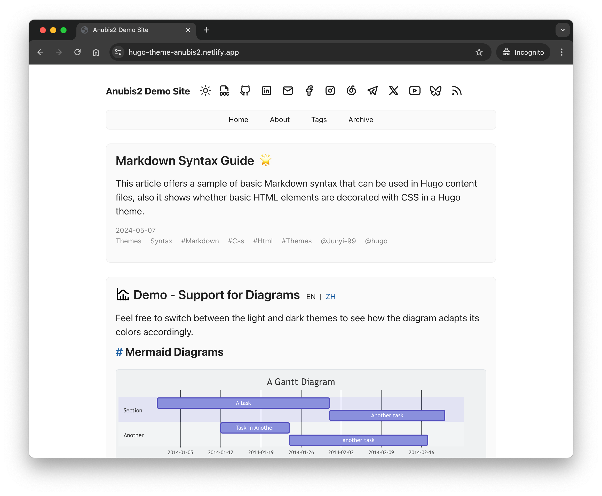
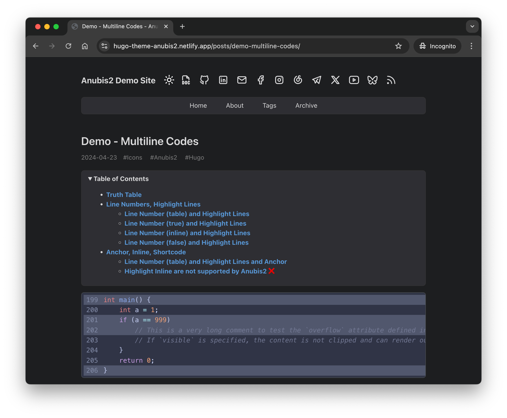
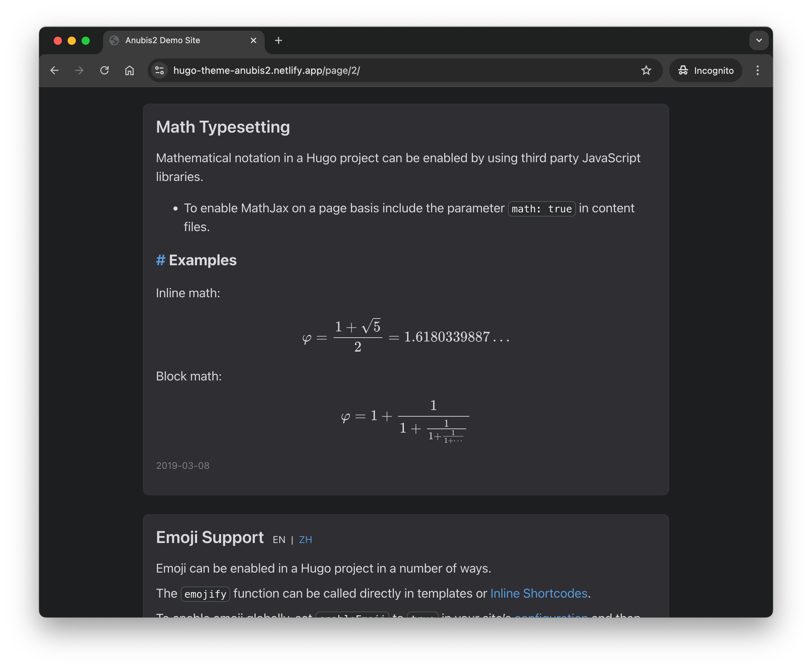

# Anubis2 Theme for Hugo [](https://opensource.org/licenses/MIT) [](https://app.netlify.com/sites/hugo-theme-anubis2/deploys)

Anubis2 is another simple minimalist theme for [Hugo blog engine](https://gohugo.io/), check our [Demo](https://hugo-theme-anubis2.netlify.app/).



|                                                        Light                                                         |                                                     Dark (Code)                                                      |                                                     Dark (Math)                                                      |
| :------------------------------------------------------------------------------------------------------------------: | :------------------------------------------------------------------------------------------------------------------: | :------------------------------------------------------------------------------------------------------------------: |
|  |  |  |


> [!IMPORTANT]  
> **Update Your Blog Configuration**  
> Please ensure your blog configuration file (`hugo.toml`, `hugo.yaml`, or `hugo.json`) is updated to the latest version provided with the template.
> 
> **Hugo frequently changes its configuration file structure**, which may lead to compatibility issues if your configuration is outdated.
>
> Check the [Anubis2 Full Config](./example-site/hugo.full.toml) for the latest full config file.  


## Highlighted Features

- Multilingual
- Dark / Light mode (Automatic switch based on system settings)
- Table of Contents
- Comment Support (Giscus, Disque, ISSO, Utterances, GraphComment)
- Analytics (Google, Umami)
- RSS feeds
- Mobile Support
- [Full Features](wiki/Full-Features)

## Installation & Configuration

You need to install an extended version of Hugo to run this theme.

For more information read the [official setup guide of Hugo](https://gohugo.io/installation/).

### Install theme as Git Submodule

Inside the folder of your Hugo site, run:

```bash
git submodule add https://github.com/hugo-theme-anubis2/hugo-theme-anubis2.git themes/anubis2
```

That's all, let's configure anubis2.

### Configure your site

Don't be panic, configure Anubis2 is really **simple**.

**This is the minimum configuration:**

```toml
baseURL = "/"
languageCode = "en-us"
title = "Anubis2 Demo Site"
theme = "anubis2"

[pagination]
pagerSize = 5

[params.author]
name = "Junyi"

[[menu.main]]
identifier = "home"
name = "Home"
url = "/"
weight = 1

[[menu.main]]
identifier = "about"
name = "About"
url = "/about/"
weight = 2

[[menu.main]]
identifier = "tags"
name = "Tags"
url = "/tags/"
weight = 3

[[menu.main]]
name = "Archive"
identifier = "archive"
url = "/posts/"
weight = 4

[markup.goldmark.renderer]
unsafe = true # Enable unsafe mode to have a better experience

[markup.highlight]
style              = 'catppuccin-frappe' # Find more style at here: https://swapoff.org/chroma/playground/

[params.anubis2]
  # Leave all parameters empty to use the default values.

```

You are encouraged keeping other fields as defaults and fine-tune them when you have time!

In the other way, you can check out the example site's [configuration file](example-site/hugo.full.toml)

## Run your site

In order to see your site, run Hugo's built-in local server.

```bash
hugo server
```

Now enter [`http://localhost:1313`](http://localhost:1313/) in the address bar of your browser to open your site.

## Update Anubis2 to the latest version

In your Hugo site folder, run this command:

```bash
git submodule update --remote
```

## Contributing

If you find a bug or have an idea for a feature, feel free to write an [issue](https://github.com/hugo-theme-anubis2/hugo-theme-anubis2/issues) or make a PR.

## License

MIT © Junyi, 2024
